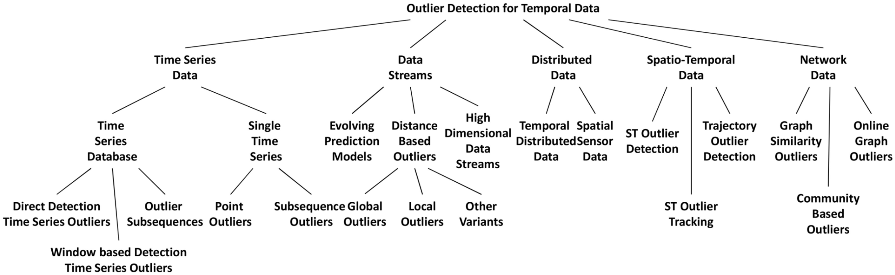
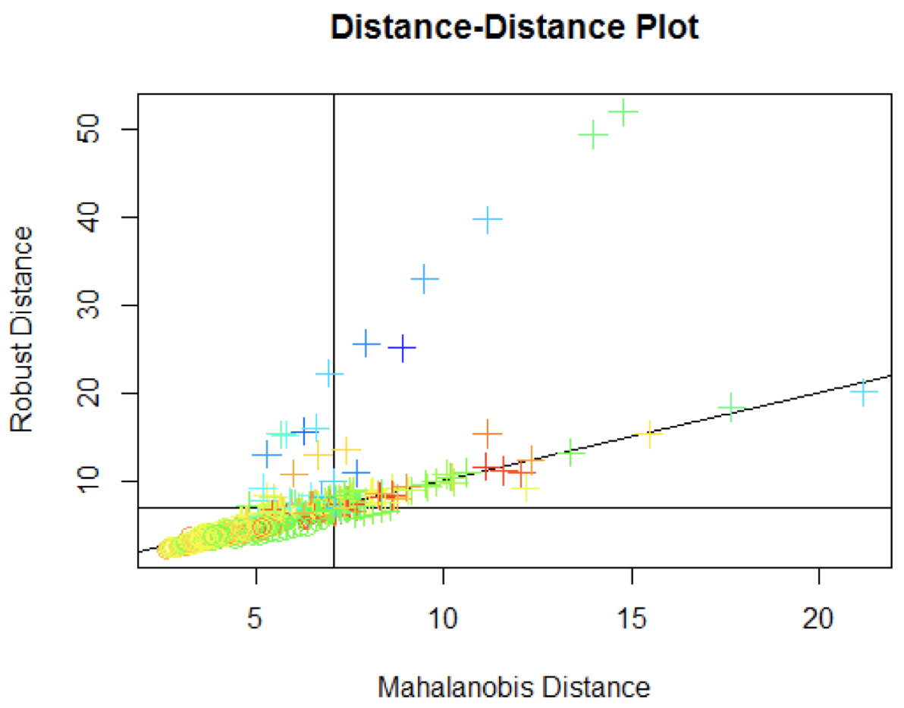
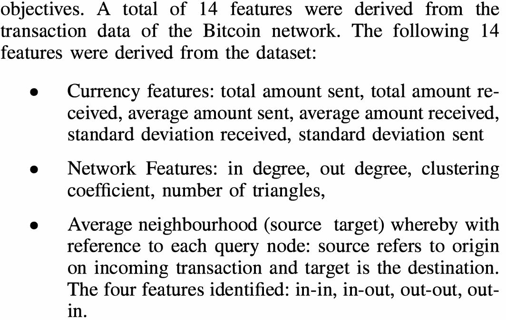
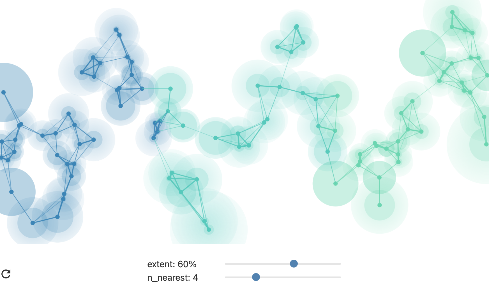
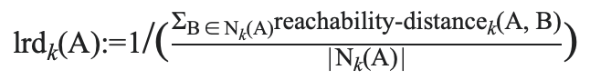
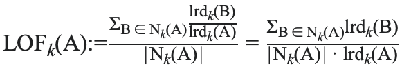
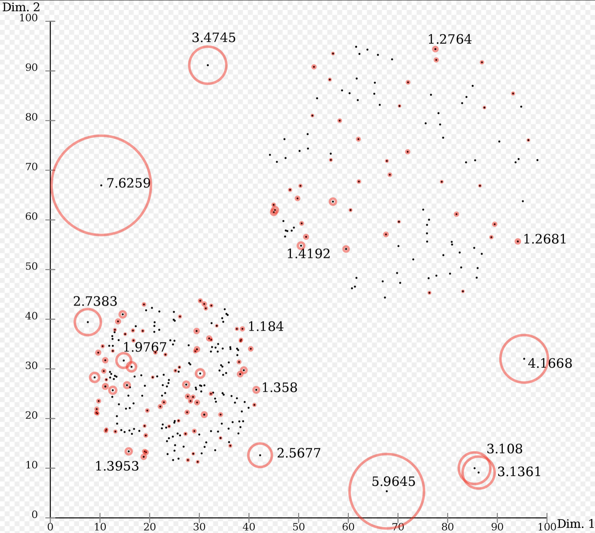

```{r setup, include = F}
knitr::opts_chunk$set(
	eval = T,
	echo = T,
	message = FALSE,
	warning = FALSE
)
```


# Définition

In data analysis, anomaly detection (also **outlier detection**) is the **identification of rare items, events or observations** which raise suspicions by differing significantly from the majority of the data.

- Dans le domaine de l'apprentissage non-supervisée (pas de « label »)
- Pour détecter des données qui sont atypiques pour la distribution de probabilité observée
- Difficulté: on ne connait pas la distribution sous-jacente des données
- L'algorithme doit donc apprendre une métrique appropriée pour détecter les anomalies


# Exemples d'applications

- Transactions bancaires (une anomalie est vue comme une fraude potentielle)
- Surveillance des données physiologiques d’un malade (l’anomalie est un problème de santé possible)
- Détection de défauts dans des chaines de production


# Types de méthodes de détection d'anomalies

- **Les techniques statistiques**
  - Construisent un modèle avec un intervalle de confiance à partir des données existantes
  - Les nouvelles données qui ne correspondent pas à ce modèle seront considérées anormales
  - Peuvent être paramétriques ou non-paramétriques
  
- **Les techniques basées sur la proximité**
  - Regroupent les techniques basées sur les plus proches voisins et sur le clustering
  
- **Les techniques basées sur le deep learning**
  - Auto-encodeurs
  - One-Class Neural Networks

- **Les autres techniques**
  - Machines à vecteur de support
  - Réseaux de neurones
  - Etc.


# Approches populaires 

- **Local Outlier Factor (LOF)**
  - On attribue à chaque donnée un score (LOF) fondé sur le ratio obtenu en comparant la densité locale d’une observation à celle de ses plus proches voisins. Les points observés ayant une faible densité locale comparativement à leurs plus proches voisins sont considérés comme des anomalies.
- **Isolation Forest** 
  - Cet algorithme cherche à isoler les observations avec des coupures successives et aléatoires (arbre de décision). Les points faciles à isoler (qui sont seuls ou dans une région à faible densité) sont considérés comme des anomalies. Les points issues de zones à forte densité (durs à isoler) sont considérées comme normaux.
- **One-class SVM**
  - Il s’agit de définir un hyper-plan (un plan dans un espace 3+D) qui rassemble la majeure partie des données d’un côté (la normalité), et peu ou pas de l’autre (les anomalies). Le plan agit comme frontière décisionnelle pour les nouvelles données.
  
  
# Détection d'anomalies avec données télématique

- **Semiautonomous Vehicle Risk Analysis: A Telematics-Based Anomaly Detection Approach**
  - Étudie la structure de risque des véhicule semi-autonome et utilise un modèle de détection des anomalies basé sur la télématique pour évaluer les profils de risque.
  - An unsupervised multivariate Gaussian (MVG) based anomaly detection method is used to identify abnormal driving patterns based on accelerometer and GPS sensors of manually driven vehicles.
  - Ils ont l'air d'avoir de l'information plus détaillée que nous.
  - Article introuvable gratuitement (DOI: 10.1111/risa.13217)

- **Detecting Anomalous Taxi Trajectories from GPS Traces**
  - Ils détectent les anomalies dans les trajets de taxis équipés de GPS. 
  - Pour éviter la fraude, entre autres: certains chauffeurs prennenet des détours inutiles.
  - Utilisent du "isolation-based anomaly detection".

- **Coupled IGMM-GANs with Applications to Anomaly Detection in Human Mobility Data**
  - Développent une méthode qui permet de créer des trajets synthétiques mais réalistes, ce qui facilite la détection d'anomalies par la suite.  
  

# Détection de fraude en assurance automobile

"The literature on unsupervised auto insurance fraud detection is extremely sparse."

- **Auto insurance fraud detection using unsupervised spectral ranking for anomaly**
  - Détection de fraude pour les réclamations en assurance auto.
  - Proposent "a new unsupervised spectral ranking method for anomaly (SRA)", qui permet de faire un "ranking" des anomalies.
  - Leur méthode n'utilise pas de labels (car non-supervisé), mais il ont un jeu de données avec des labels qui permet d'évaluer la performance.

- **Using Kohonen's self-organizing feature map to uncover automobile bodily injury claims fraud**
  - Essaient de détecter les fraudes de réclamation en assurance auto avec un genre de réseau de neurones appelé "self-organizing feature map".

- **Fraud classification using principal component analysis of RIDITs**
  - Détection de fraudes de réclamations avec analyse des composantes principales sur les scores RIDIT (ils appellent leur méthode PRIDIT).
  - Leur méthode permet à la fois de déterminer la "force" des variables et de donner un score de suspicion à chaque réclamation.

- **A robust unsupervised method for fraud rate estimation**
  - Proposent une nouvelle méthode pour estimer le taux de fraude, appelée PRIDIT-based Fraud Rate Estimation. 
  - Examinent le de fraudes dans une population de réclamations.

- **Assessing consumer fraud risk in insurance claims: an unsupervised learning technique using discrete and continuous predictor variables**
  - Extension de la méthode PRIDIT, mais pour d'autres types de prédicteurs (catégoriel ordinal, par exemple).
  

# Surveys et reviews sur la détection d'anomalies

- [Outlier Detection for Temporal Data: A Survey](https://sci-hub.se/10.1109/tkde.2013.184)
- [A review on outlier/anomaly detection in time series data](https://arxiv.org/pdf/2002.04236.pdf)
- [A survey of anomaly detection techniques in financial domain](https://sci-hub.se/10.1016/j.future.2015.01.001)


# Différentes facettes de la détection d'anomalies pour données temporelles

## Time-series vs Multidimensional Data Facet

- L'aspect temporel est-il important ou non?
- Plutôt **time-series** avec les données qu'on a. Comme on disait, si quelqu'un commence à travailler de nuit pendant quelques mois, on veut probablement que les premiers 2-3 trajets soient des outliers, mais pas les autres.

## The Point vs Window Facet

- Are we looking for an unusual data point in a temporal series or are we looking for an unusual pattern of changes?

## The Data Type Facet

- Continuous series, discrete series, multi-dimensional streams or network data.
- Probablement **discrete series**.

## The supervision facet

- Are previous examples of anomalies available?
- Dans notre cas, ça serait plutôt **non-supervisé**.

  


On se situe probablement dans *Time Series Data* (ou bien peut-être *Data Streams*). Est-ce qu'on veut trouver des time series anormales dans une base de données de time series (*Time Series Database*) ou bien on veut trouver un ou des points (trajets) anormaux dans une seule time series (*Single Time Series*)?


# Littérature « Single Time Series »

## Points as Outliers

### Prediction models

- [Automatic outlier detection for time series: an application to sensor data (2007)](https://sci-hub.se/10.1007/s10115-006-0026-6)
- [Anomaly detection in streaming environmental sensor data: A data-driven modeling approach (2010)](https://sci-hub.se/10.1016/j.envsoft.2009.08.010)
- [Online novelty detection on temporal sequences (2003)](https://sci-hub.se/10.1145/956750.956828)
- [Modeling flat stretches, bursts, and outliers in time series using mixture transition distribution models (1996)](https://citeseerx.ist.psu.edu/viewdoc/download?doi=10.1.1.143.1187&rep=rep1&type=pdf)
- [Outliers in multivariate time series (2000)](https://sci-hub.se/10.2307/2673610)
- [Detecting possibly non-consecutive outliers in industrial time series (1998)](https://sci-hub.se/10.1111/1467-9868.00126)
- [Detection of outlier patches in autoregressive time series (2001)](http://halweb.uc3m.es/esp/Personal/personas/dpena/publications/ingles/2001SS_justel_tsay.pdf)
- [Outlier detection in multi- variate time series by projection pursuit (2006)](https://sci-hub.se/10.1198/016214505000001131)

### Profile Similarity based Approaches

- [Black-box failure prediction in distributed systems (2007)](https://core.ac.uk/download/pdf/192966333.pdf)

### Deviants

- [Mining deviants in time series data streams (2004)](https://sci-hub.se/10.1109/ssdm.2004.1311192)

## Subsequences as Outliers

- [Finding the most unusual time series subsequence: Algorithms and applications (2006)](https://sci-hub.se/10.1007/s10115-006-0034-6)
- [Efficiently finding the most unusual time series subsequence (2005)](https://sci-hub.se/10.1109/icdm.2005.79)
- [Approximations to magic: Finding unusual medical time series (2005)](https://sci-hub.se/10.1109/cbms.2005.34)
- [Disk aware discord discovery: Finding unusual time series in terabyte sized datasets (2007)](https://sci-hub.se/10.1109/icdm.2007.61)


# Littérature « Time Series Database »

## Direct Detection of Outlier Time Series

### Unsupervised Discriminative Approaches

- [A comparative evaluation of anomaly detection techniques for sequence data (2008)](https://sci-hub.se/10.1109/icdm.2008.151)
- [Finding anomalous periodic time series (2009)](https://sci-hub.se/10.1007/s10994-008-5093-3)
- [Anomaly detection using real-valued negative selection (2003)](https://dis.unal.edu.co/~fgonza/papers/GPEM2003.pdf)

### Unsupervised Parametric Approaches

- [Mining for outliers in sequential databases (2006)](https://sci-hub.se/10.1137/1.9781611972764.9)
- [Learning states and rules for detecting anomalies in time series (2005)](https://sci-hub.se/10.1007/s10489-005-4610-3)

### Unsupervised OLAP Based Approach

- [Mining approximate top-k subspace anomalies in multi-dimensional time-series data (2007)](http://www.vldb.org/conf/2007/papers/research/p447-li.pdf)

### Supervised Approaches

- [Learning classifiers for misuse detection using a bag of system calls representation (2005)](https://www.researchgate.net/publication/4168242_Learning_Classifiers_for_Misuse_Detection_Using_a_Bag_of_System_Calls_Representation)

## Window-Based Detection of Outlier Time Series

### Normal Pattern Database Approach

- [An application of machine learning to anomaly detection (1997)](https://sci-hub.se/10.1088/1742-6596/1176/3/032015)

### Negative and Mixed Pattern Database Approaches

- [Anomaly detection in multi- dimensional data using negative selection algorithm (2002)](https://sci-hub.se/10.1109/cec.2002.1004386)


# Littérature « Data streams »

## Evolving Prediction Models

- [On-line unsupervised outlier detection using finite mixtures with discounting learning algorithms (2004)](https://sci-hub.se/10.1145/347090.347160)
- [On clustering massive text and categorical data streams (2010)](https://sci-hub.se/10.1007/s10115-009-0241-z)
- [Real-time Bayesian anomaly detection for environmental sensor data (2007)](https://citeseerx.ist.psu.edu/viewdoc/download?doi=10.1.1.85.8809&rep=rep1&type=pdf)

## Distance-Based Outliers for Sliding Windows

- [Detecting distance-based outliers in streams of data (2007)](https://sci-hub.se/10.1145/1321440.1321552)
- [Neighbor-based pattern detection for windows over streaming data (2009)](https://sci-hub.se/10.1145/1516360.1516422)
- [Efficient anomaly monitoring over moving object trajectory streams (2009)](https://sci-hub.se/10.1145/1557019.1557043)
- [Attribute outlier detection over data streams (2010)](https://sci-hub.se/10.1007/978-3-642-12098-5_17)
- [Incremental local outlier detection for data streams (2007)](https://sci-hub.se/10.1109/cidm.2007.368917)

## Outliers in High-Dimensional Data Streams

- [SPOT: A system for detecting projected outliers from high-dimensional data streams (2008)](https://www.researchgate.net/publication/221465186_Detecting_Projected_Outliers_in_High-Dimensional_Data_Streams)


# Autre articles
- [RLAD: Time Series Anomaly Detection through Reinforcement Learning and Active Learning (2021)](https://arxiv.org/pdf/2104.00543.pdf)
- [Robust and Unsupervised Anomaly Detection for Multivariate Dataset (2020)](https://d1wqtxts1xzle7.cloudfront.net/64790193/IRJET_V7I9692.pdf?1603882241=&response-content-disposition=inline%3B+filename%3DIRJET_Robust_and_Unsupervised_Anomaly_De.pdf&Expires=1623170369&Signature=LFEadCgIFsjI8warUfIabB4JXeIT565fPPvVEFe5KQdUZr4dkoLI4fo0bn6faQ6H74Jbo0hpjGBQkzYUHLDaDiYSpTY7-EUR30Eerz03hv3M89DkldnbeGs0gcY2G-xgOkxSpHCkBRqrU5SNSNtswu-G2HmLPYu0YScbrg4f3ygwp-naxVt65KPIUMYL3EvkMlajp~E6FtEvG3hxZRHR4r4DIyWTimu4F23G4F4~34N8unxdPZJHoQJDBc5K-KF5IfGjtIc3UfxDIXTN4Hg6yf1v1BhTa7p127ry~H7SVmafpGKkUXuNpkceGgdReswMZ9bWm2277RQpX6vRepQSuw__&Key-Pair-Id=APKAJLOHF5GGSLRBV4ZA)
- [Outlier Detection in Multivariate Data (2015)](http://www.m-hikari.com/ams/ams-2015/ams-45-48-2015/13manojAMS45-48-2015-96.pdf)
- [ICSOutlier: Unsupervised Outlier Detection for Low-Dimensional Contamination Structure (2018)](https://journal.r-project.org/archive/2018/RJ-2018-034/RJ-2018-034.pdf)
- [REPPlab: An R package for detecting clusters and outliers using exploratory projection pursuit (2018)](https://arxiv.org/pdf/1612.06518.pdf)
- [Ensembles for unsupervised outlier detection: challenges and research questions a position paper (2014)](https://sci-hub.se/10.1145/2594473.2594476)

# Détection d'anomalies non-supervisée

- [**Credit Card Fraud Detection using autoencoder based clustering (2018)**](https://sci-hub.se/10.1109/istel.2018.8661129)
  - Jeu de données Européen contenant 285 000 transactions sur 2 jours.
  - Les données consistent en **28 composantes principales** (pour raisons de confidentialité) + « **time** » et « **amount** ». Probablement le jeu de données Kaggle.
  - Utilisation d'un auto-encodeur (donc pas besoin de labels), mais ils mesurent la performance en utilisant des labels.
  - Pas un super article je trouve.
- [**Credit Card Fraud Detection: A Realistic Modeling and a Novel Learning Strategy (2018)**](https://sci-hub.se/10.1109/TNNLS.2017.2736643)
- [**Combining unsupervised and supervised learning in credit card fraud detection (2019)**](https://sci-hub.se/10.1016/j.ins.2019.05.042)
- [**Anomaly Detection using Unsupervised Methods: Credit Card Fraud Case Study (2019)**](https://thesai.org/Downloads/Volume10No11/Paper_1-Anomaly_Detection_using_Unsupervised_Methods.pdf)
  - « However, normal transaction labels are needed for most of the unsupervised methods so machine learning techniques would be trained on normal transaction so it can differentiate between normal and fraud for the upcoming transactions. » Nous on veut un algorithme qui n'a pas du tout besoin de labels.
  - Les données consistent en **28 composantes principales** (pour raisons de confidentialité) + « **time** » et « **amount** ». Probablement le jeu de données Kaggle.
  - Utilisent un **One-Class SVM**, un **auto-encodeur** et la **méthode de Mahalanobis** pour la classification. Pour le One-class SVM et pour l'auto-encodeur, on a besoin de savoir quelles sont les observation normale. Seule la méthode de Mahalanobis est complètement non-supervisée.
  - Méthode de Mahalanobis:
    - Pour chaque observation, on calcule la distance de Mahalanobis (mesure la distance entre l'obseravtion et la distribution empirique). Ensuite, on peut tracer un graphique « distance-distance » pour repérer les anomalies, ou bien se donner un « threshold » et dire que toutes les observations qui dépassent ce threshold sont des anomalies.
    - Pas un super article je trouve.
    - 

- [**Autoencoding Credit Card Fraud**](https://www.cs.ru.nl/bachelors-theses/2018/Tom_Sweers___4584325___Autoencoding_credit_card_fraude.pdf)
  - Utilisation **d'auto-encodeurs** (donc non-supervisé) pour détecter les anomalies et donc les fraudes de cartes de crédit.
  - Les données consistent en **28 composantes principales** (pour raisons de confidentialité) + « **time** » et « **amount** ». Probablement le jeu de données Kaggle.
  - Bien qu'il font de l'apprentissage non-supervisé, ils ont quand même les **labels** pour chaque transaction. Ils disent qu'ils entrainent leurs auto-encodeurs seulement sur les données « normales » (donc non-frauduleuses). Donc finalement, est-ce qu'on peut vraiment appeler ça de l'apprentissage non-supervisé?
  - Thèse de niveau baccalauréat
  
- [**Unsupervised Learning for Robust Bitcoin Fraud Detection**](https://sci-hub.se/10.1109/issa.2016.7802939)
  - Utilisent un jeu de données de 37 millions de transactions de Bitcoins reliées à 6 millions d'utilisateurs.
  - Ils créent des features reliées aux utilisateurs. Donc on veut déterminer les utilisateurs anormaux.
  - - 
  - Complètement non-supervisé.
  - Utilisent du K-means clustering et du Trimmed K-means clustering. Ils réussissent à trouver 5 des 30 utilisateurs frauduleux de la base de données.
  
- [**Credit Card Fraud Detection in e-Commerce: An Outlier Detection Approach (2019)**](https://arxiv.org/pdf/1811.02196v2.pdf)
  - Code disponible [ici](https://github.com/sud2268/Credit-card-Fraud-Detection)
  - Méthode qui n'a pas besoin du tout de labels.
  - En gros, on ajuste un k-means clustering N fois sur les données avec différentes valeurs de k. Ça donne N centroïdes pour chaque observation. On calcule finalement un « score de cohérence » pour chaque observation à partir de ces N centroïdes.
  - Ils testent leur méthode sur différent jeux de données, dont le jeu de données Kaggle de détection de fraudes de cartes de crédit.
    
- [**Isolation Forest (2008)**](https://sci-hub.se/10.1109/ICDM.2008.17) 
- [**LOF: Identifying Density-Based Local Outliers (2000)**](https://www.dbs.ifi.lmu.de/Publikationen/Papers/LOF.pdf)
- [**Automatic Hyperparameter Tuning Method for Local Outlier Factor, with Applications to Anomaly Detection**](https://arxiv.org/pdf/1902.00567.pdf)
  - Proposent une méthode heuristique pour choisir *k* (le nombre de voisins) et *c* (le pourcentage d'anomalies) de manière jointe.
  - Le problème avec cette méthode est qu'elle donne un *k* optimal pour un *c* fixe. Nous, on ne veut pas avoir à choisir une valeur pour *c*.


# UMAP

## Comment ça marche

* L'algorithme est assez compliqué au niveau mathématique, surtout que c'est basé sur la **topologie**, un domaine qui nous intéresse moins en actuariat.
* L'algorithme construit d'abord un complexe simplicial flou (**fuzzy simplicial complex**) sur les données. C'est un ensemble de simplexes (généralisation du triangle en n dimensions). On peut voir ça comme un **graphe**, mais « fuzzy », c'est-à-dire que les connexions ont des poids.
  + 
* Ensuite, l'algorithme prend le graphe en plusieurs dimensions et en fait une représentation en 2D la plus fidèle possible. Pour ce faire, les points qui ont des connexions plus fortes vont rester plus proches dans l'espace en 2D, alors que les points liés moins fortement vont s'éloigner.
* Il y a un hyperparamètre à calibrer qui est le nombre de plus proches voisins à prendre en compte. Si ce paramètre est petit (grand), UMAP préservera plutôt la structure locale (globale). C'est un compromis à faire. J'ai pris le paramètre par défaut, c'est-à-dire neighbors = 15.

## Avantages

* Par rapport à l'ACP, UMAP permet de mieux préserver la structure **locale** des données. L'ACP ne préserve que la structure **globale** des données. Ça fait qu'on peut mieux voir les clusters dans les données.
* Par rapport à t-SNE, UMAP permet de mieux préserver la structure **globale** des données. Le t-SNE ne préserve que la structure **locale** des données. La distance à l'intérieur des clusters est donc fiable, mais pas celle entre les clusters. En fait, UMAP des hyperparamètres qui déterminent le compromis entre structure **locale** et **globale**.
* Plus rapide que t-SNE, et contrairement à ce dernier, on peut l'appliquer sur de nouvelles données.
* « Scaling well in terms of both dataset size and dimensionality ». t-SNE devient moins bon avec beaucoup de dimensions et est beaucoup moins rapide.
* Selon ce que j'ai lu, c'est un des meilleurs sinon le meilleur algorithme de réduction de dimensions. 

## Liens utiles

* [Vidéo YouTube #1](https://www.youtube.com/watch?v=6BPl81wGGP8)
* [Vidéo YouTube #2](https://www.youtube.com/watch?v=nq6iPZVUxZU)
* [Site Internet UMAP](https://umap-learn.readthedocs.io/en/latest/)
* [Site où on peut jouer avec les paramètres sur différents jeux de données](https://pair-code.github.io/understanding-umap/)


# Local Outlier Factors

* Technique qui permet d'assigner une **mesure du degré d'anormalité** à chaque point d'un jeu de données.
* Technique intéressante car **non dichotomique** (ce n'est pas tout blanc ou tout noir).
* Technique intéressante car elle permet de détecter les **anomalies locales** (et pas seulement globales).
* Fonctionne bien en **plusieurs dimensions**.
* Fonctionne en comparant la densité locale d'un point avec la densité locale de son **voisinage**.
* Inconvénient: la valeur obtenue pour chaque point est un quotient qui est **difficile à interpréter**.

**Fonctionnement**

* Il faut d'abord choisir *k*, le nombre de voisins, qui est un hyperparamètre.
* Ensuite, on calcule pour chaque point la **local reachability density**, c'est-à-dire l'inverse de la distance typique (ou moyenne) à laquelle le point peut être « atteint » par ses *k* voisins. Donc moins le point est atteignable par ses voisins (donc distance élevée), plus la densité sera faible. Ici la *reachability-distance* est une distance définie par l'auteur pour que l'algorithme soit plus stable: on aurait pu aussi utiliser la distance euclidienne. En mots, la formule suivante calcule l'inverse de la *reachability-distance* moyenne de A à partir de ses *k* voisins. Noter que la *reachability-distance* n'est pas une distance au sens mathématique du terme car non symétrique.
  + 
  + En termes plus simples, plus les *k* voisins de A sont éloignés (proches), plus la densité locale de A sera faible (élevée).
* Finalement, pour calculer le *local outlier factor* (LOF) pour chaque point A, on compare sa *local reachability density* avec la *local reachability density* moyenne de ses *k* voisins (on divise la *local reachability density* moyenne des *k* voisins par la *local reachability density* de A).
  + 
  + Si LOF(A) > 1, A est un outlier parce que sa densité locale est plus petite que celle de ses voisins.
  + Si LOF(A) < 1, A est un inlier parce que sa densité locale est plus grande que celle de ses voisins.

**Exemple des scores obtenus sur un jeu de données en 2 dimensions**



# Notes

* Est-ce qu'on a vraiment des données de type « time series »? Le prix d'une action au cours du temps est clairement une série temporelle parce que le prix au temps x est fortement dépendant du prix au temps x - 1. La température à chaque jour aussi. Avec les données de trajets qu'on a, il n'y a pas trop de dépendance temporelle je pense. La distance parcourue le 29 janvier n'est pas si dépendante de la distance parcourue le 28 janvier. On serait peut-être plus dans « détection d'anomalies multivariée » plutôt que dans « détection d'anomalies dans les séries temporelles ».

* Est-ce qu'on devrait agréger un peu les données? Par jour? Par semaine?

* Pour les variables encodées de manière circulaire: ce ne sont pas des variables ordinaires, donc il faut probablement faire attention à la manière dont on les modélise.

* Répétition d'information 2 variables cycliques?

* Une fois qu'on a déterminé les trajets anormaux (ou un score d'anormalité pour chaque trajet) pour un assuré, on fait quoi avec? On essaie de créer une feature avec pour donner en entrée à de l'apprentissage supervisé de réclamations?

* En utilisant la méthode LOF, on peut calculer un score d'anomalie pour chaque trajet. Ensuite on voudrait utiliser ces scores d'anomalie pour la prédiction de réclamations. 
  + Comment on donne en entrée ces scores aux modèles? En calculant des statistiques pour chaque véhicules? Du genre « moyenne du score d'anomalie », « variance de score d'anomalie », etc.
  + Est-ce qu'il y aurait moyen de ne pas résumer l'information et de donner la distribution complète des scores d'anomalie aux modèles? Peut-être avec un réseau de neurones. Cependant, chaque véhicule a un nombre différent de trajets. On pourrait donner en entrée aux modèles des histogrammes des scores.
