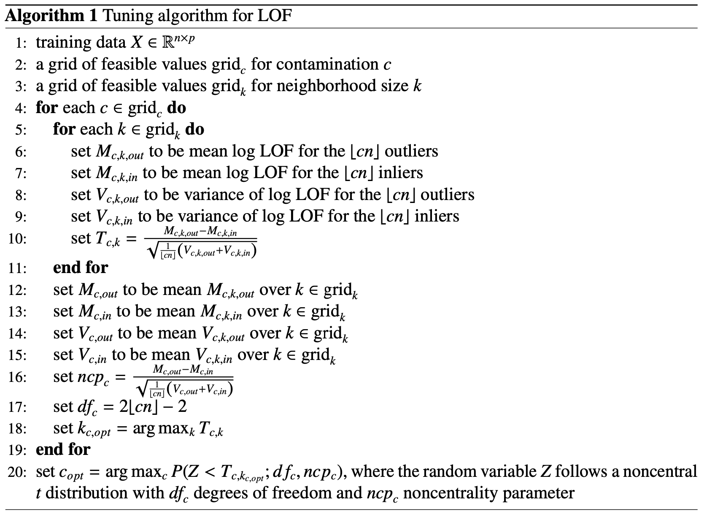

```{r setup, include=FALSE}
knitr::opts_chunk$set(
	eval = T,
	echo = T,
	message = FALSE,
	warning = FALSE
)
```

\newcommand\floor[1]{\lfloor#1\rfloor}

# Résumé

* Méthode dévelopée en 2019 dans cet [article](https://arxiv.org/pdf/1902.00567.pdf) pour calibrer les 2 hyperparamètres de la méthode LOF.
  + $k$: nombre de plus proches voisins à utiliser dans l'algorithme LOF.
  + $c$: le taux de contamination, c'est-à-dire la proportion des observations à étiqueter « outliers ».
    - Donc si on a $n$ observations, les $\floor{cn}$ observations avec les LOFs les plus élevés seront considérées des outliers
* La méthode consiste à trouver la combinaison $(c, k)$ qui maximise la distance entre les 2 distributions suivantes: 
  + La distribution des LOFs pour les $\floor{cn}$ outliers prédits
  + La distribution des LOFs pour les $\floor{cn}$ inliers ayant les scores LOFs les plus élevées (autrement dit, les $\floor{cn}$ observations les plus anormales parmis les observations normales).
* La méthode requiert de premièrement construire un grille d'hyperparamètres.
* Si on connait déjà la valeur de $c$, on peut la fixer et utiliser la méthode pour trouver $k$ seulement.

# Détails

* On définit premièrement une grille de valeurs pour $k$ et $c$. 
  + Par exemple, ça pourrait être $\text{grid}_c = (0.01, 0.02, 0.05)$ et $\text{grid}_k = (10, 20)$
* Ensuite, on va calculer les LOFs pour chaque combinaison possible de $c$ et $k$, donc pour:
  + $(c, k) = (0.01, 10)$
  + $(c, k) = (0.01, 20)$
  + $(c, k) = (0.02, 10)$
  + $(c, k) = (0.02, 20)$
  + $(c, k) = (0.05, 10)$
  + $(c, k) = (0.05, 20)$
* On va ensuite définir:
  + $M_\text{c, k, out}$ la **moyenne** empirique des log(LOF) calculés avec $c$ et $k$ pour les $\floor{cn}$ **outliers** prédits
  + $V_\text{c, k, out}$ la **variance** empirique des log(LOF) calculés avec $c$ et $k$ pour les $\floor{cn}$ **outliers** prédits
  + $M_\text{c, k, in}$ la **moyenne** empirique des log(LOF) calculés avec $c$ et $k$ pour les $\floor{cn}$ **inliers**
  + $V_\text{c, k, in}$ la **variance** empirique des log(LOF) calculés avec $c$ et $k$ pour les $\floor{cn}$ **inliers**
+ Pour chaque paire $(c, k)$, on définit la **différence normalisée** de la moyenne des log(LOF) entre les **outliers** prédits et les **inliers**:
  * $T_{c, k} = \frac{M_\text{c, k, out} - M_\text{c, k, in}}{\sqrt{\frac{1}{\floor{cn}}(V_\text{c, k, out} + V_\text{c, k, in})}}$
  * Dans notre exemple, on va donc calculer 6 différences normalisées, c'est-à-dire:
    - $T_{0.01, 10}$
    - $T_{0.01, 20}$
    - $T_{0.02, 10}$
    - $T_{0.02, 20}$
    - $T_{0.05, 10}$
    - $T_{0.05, 20}$
  * L'idée derrière l'algorithme est de trouver $c$ et $k$ qui **maximisent la différence** entre les LOFs des **outliers** et les LOFs des **inliers**.
  * À ce stade, si on connait la valeur de $c$, on n'a qu'à choisir $k$ qui maximise $T_{c, k}$.
* Si $c$ n'est pas connu *a priori*, on va d'abord trouver la valeur de $k$ optimale pour chaque valeur de $c$ dans $\text{grid}_c$.
  + Donc pour chaque $c \in \text{grid}_c$, on détermine $k_{\text{c, opt}} = \text{argmax}_k T_{c, k}$.
* Ensuite, on va supposer que pour chaque valeur de $c$, 
  + les log(LOF) des **outliers** suivent une loi normale $(\mu_{c, out}, \sigma^2_{c, out})$
  + les log(LOF) des **inliers** suivent une loi normale $(\mu_{c, in}, \sigma^2_{c, in})$
* Donc sachant $c$, $T_{c, k}$ suit approximativement une loi $t$ non-centrée à $2\floor{cn} - 2$ degrés de liberté avec $\frac{\mu_\text{c, out} - \mu_\text{c, in}}{\sqrt{\frac{1}{\floor{cn}}(\sigma^2_\text{c, out} + \sigma^2_\text{c, in})}}$ comme paramètre de non-centralité.
* On ne peut pas comparer directement la plus grande différence normalisée $T_{c, k_{c, opt}}$ entre différentes valeurs de $c$ parce que la distribution de $T_{c, k}$ dépend de $c$. C'est pourquoi on va comparer les quantiles correspondant à $T_{c, k_{c, opt}}$ au lieu des valeurs telles quelles.
  + En termes mathématiques, on va choisir $c_{opt} = \text{argmax}_c P(Z < T_{c, k_{c, opt}}; \text{df}_c, \text{ncp}_c)$ où Z suit une loi $t$ non-centrale avec $\text{df}_c$ degrés de liberté et $\text{ncp}_c$ comme paramètre de non-centralité.
  + Puisqu'on n'observe pas le paramètre de non-centralité, on va l'estimer avec les données.

Voici l'algorithme:



# Notes

* J'ai trouvé un [code Python](https://github.com/vsatyakumar/automatic-local-outlier-factor-tuning/blob/master/lof_tuner.py) qui fait l'implémentation de cette méthode. Je pourrais me baser sur ce code pour l'implémenter en R. 
* On ne connait pas la valeur de $c$ pour notre jeu de données. Il va donc falloir le calibrer. On pourrait peut-être utiliser $\text{grid}_c = (0.01, 0.02, 0.05, 0.1)$.
* Pour les valeurs de $k$, on pourrait utiliser $\text{grid}_k = (10, 20, 50, 100)$.
* Avec cette méthode, on obtiendrait une paire $(c, k)$ optimale pour chaque conducteur.
